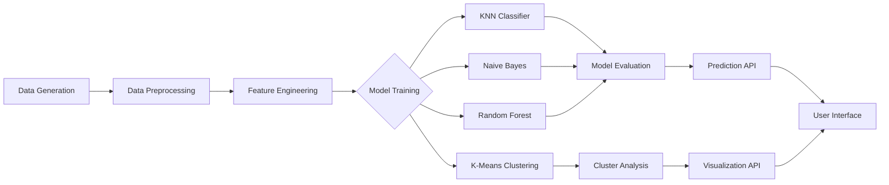

# 🏢 Apartment Rent Predictor

<div align="center">


</div>

<p align="center">
  <b>A sophisticated full-stack machine learning application for apartment rental price prediction and market segmentation</b>
</p>

<p align="center">
  
</p>

## 📋 Overview

Apartment Rent Predictor is an advanced analytics platform that combines machine learning algorithms with an intuitive user interface to provide accurate rental price predictions and market insights. This project was developed as a semester project for Artificial Intelligence course, utilizing the UCI Apartment Rent Classification dataset. The application leverages multiple classification and clustering techniques to help users make data-driven decisions in the rental market.

### Why Apartment Rent Predictor?

- **Data-Driven Decision Making**: Make informed rental decisions backed by ML predictions
- **Market Segmentation**: Understand different apartment clusters and their characteristics
- **Model Comparison**: Compare multiple ML models to identify the most accurate prediction technique
- **Interactive Interface**: User-friendly dashboard with responsive design and visual analytics

## 🛠️ Tech Stack

<table>
  <tr>
    <td><b>Backend</b></td>
    <td>
      
      
      
      
      
      
    </td>
  </tr>
  <tr>
    <td><b>Frontend</b></td>
    <td>
      
      
      
      
    </td>
  </tr>
  <tr>
    <td><b>DevOps</b></td>
    <td>
      
      
      
    </td>
  </tr>
</table>

## 🌟 Features

### 🤖 Machine Learning Models

- **Classification Algorithms**:
  - K-Nearest Neighbors (KNN)
  - Naive Bayes (NB)
  - Random Forest (RF)

- **Clustering Technique**:
  - K-Means for market segmentation

- **Advanced Analytics**:
  - Model evaluation with comprehensive metrics (accuracy, precision, recall, F1 score)
  - Feature importance visualization
  - Cross-validation and hyperparameter optimization
  
### ⚙️ Backend (FastAPI + SQLite)

- **RESTful API Architecture**:
  - Prediction endpoints with model selection
  - Real-time model metrics and evaluation
  - Asynchronous processing for enhanced performance

- **Data Management**:
  - SQLite database for efficient storage
  - Synthetic dataset generation with realistic distributions
  - Data preprocessing and feature engineering

- **Visualization Services**:
  - Dynamic chart generation
  - Cluster visualization
  - Statistical analysis endpoints
  
### 🖥️ Frontend (Next.js + Tailwind CSS)

- **Responsive Dashboard**:
  - Modern UI with dark/light mode
  - Intuitive navigation system
  - Mobile-first design approach

- **Interactive Components**:
  - Real-time prediction form with instant feedback
  - Interactive visualizations and charts
  - Sortable and filterable prediction history
  - Model comparison tools

## 📂 Project Structure

```
📦 ApartmentRentPredictor
 ┣ 📂 backend                  # Python FastAPI server
 ┃ ┣ 📂 app                    # Core application code
 ┃ ┃ ┣ 📜 __init__.py
 ┃ ┃ ┣ 📜 database.py          # Database models and connection
 ┃ ┃ ┗ 📜 main.py              # FastAPI application setup
 ┃ ┣ 📂 data                   # Data storage
 ┃ ┃ ┗ 📜 apartment_data.csv   # Generated dataset (on first run)
 ┃ ┣ 📂 models                 # Machine learning models
 ┃ ┃ ┣ 📂 saved                # Serialized trained models
 ┃ ┃ ┣ 📜 __init__.py
 ┃ ┃ ┗ 📜 ml_models.py         # Model definitions and training
 ┃ ┗ 📜 main.py                # Application entry point
 ┣ 📂 frontend                 # Next.js front-end
 ┃ ┣ 📂 public                 # Static assets
 ┃ ┣ 📂 src                    # Source code
 ┃ ┃ ┣ 📂 app                  # Next.js app router
 ┃ ┃ ┃ ┣ 📂 clustering         # Clustering visualization page
 ┃ ┃ ┃ ┣ 📂 history            # Prediction history page
 ┃ ┃ ┃ ┣ 📂 models             # Model comparison page
 ┃ ┃ ┃ ┣ 📂 predict            # Prediction form page
 ┃ ┃ ┃ ┣ 📜 globals.css        # Global styles
 ┃ ┃ ┃ ┣ 📜 layout.tsx         # Root layout
 ┃ ┃ ┃ ┗ 📜 page.tsx           # Home page
 ┃ ┗ 📜 package.json           # Dependencies and scripts
 ┣ 📜 requirements.txt         # Python dependencies
 ┗ 📜 README.md                # This file
```

## 🚀 Getting Started

### Prerequisites

- Python 3.8+
- Node.js 18+
- npm or yarn
- Git

### Backend Setup

1. **Clone the repository**:
   ```bash
   git clone https://github.com/yourusername/apartment-rent-predictor.git
   cd apartment-rent-predictor
   ```

2. **Set up Python virtual environment**:
   ```bash
   cd backend
   python -m venv venv
   
   # Windows
   venv\Scripts\activate
   
   # macOS/Linux
   source venv/bin/activate
   ```

3. **Install Python dependencies**:
   ```bash
   pip install -r requirements.txt
   ```
   
   The requirements.txt file includes the following key dependencies:
   - FastAPI (0.103.1): Modern web framework for building APIs
   - scikit-learn (1.3.0): Machine learning algorithms for predictions and clustering
   - pandas (2.1.0): Data manipulation and analysis
   - matplotlib & seaborn: Data visualization libraries
   - SQLAlchemy (2.0.20): SQL toolkit and ORM
   - uvicorn (0.23.2): ASGI server for running the FastAPI application

4. **Run the FastAPI backend server**:
   ```bash
   python main.py
   ```
   
   ✅ The API will be available at `http://localhost:8000`
   
   ✅ API documentation (Swagger UI) at `http://localhost:8000/docs`

### Frontend Setup

1. **Navigate to the frontend directory**:
   ```bash
   cd frontend
   ```

2. **Install Node.js dependencies**:
   ```bash
   npm install
   ```

3. **Run the Next.js development server**:
   ```bash
   npm run dev
   ```
   
   ✅ The frontend will be available at `http://localhost:3000`

## 📊 Machine Learning Pipeline



### Data Processing Flow

1. **Data Acquisition/Generation**:
   - Synthetic data generation with realistic property distributions
   - Feature correlation setup based on real market trends

2. **Feature Processing**:
   - Standardization for numerical features
   - One-hot encoding for categorical features
   - Feature selection based on importance metrics

3. **Model Training and Evaluation**:
   - K-fold cross-validation
   - Hyperparameter tuning
   - Performance metrics calculation

## 🔌 API Reference

### Base URL
`http://localhost:8000`

### Endpoints

| Endpoint | Method | Description | Request Body | Response |
|----------|--------|-------------|-------------|----------|
| `/` | GET | Health check and welcome message | None | `{"message": "Welcome to Apartment Rent Predictor API"}` |
| `/predict/` | POST | Make a prediction with specified model | JSON with apartment features | Predicted rent and confidence score |
| `/model-metrics/` | GET | Get all model metrics | None | JSON with model performance metrics |
| `/model-metrics/{model_name}` | GET | Get metrics for specific model | None | JSON with model metrics |
| `/clustering/` | GET | Get K-means clustering results | None | Cluster centers and assignments |
| `/visualizations/{plot_type}` | GET | Get visualization data | None | Base64 encoded plot or JSON data |
| `/predictions/` | GET | Get prediction history | None | Array of past predictions |
| `/predictions/{prediction_id}` | GET | Get specific prediction details | None | Detailed prediction data |

## 📱 UI Screens

- **Dashboard**: Overview with key metrics and recent predictions
- **Predict**: Form to enter apartment details and get rental price predictions
- **Models**: Compare different ML model performances
- **Clustering**: Visualize market segments with interactive cluster plots
- **History**: View and analyze prediction history
- **Settings**: Configure application preferences

## 🧪 Dataset

The project uses the UCI Apartment Rent Classification dataset, which provides real-world data for rental price prediction. The dataset includes the following features:

| Feature | Type | Description |
|---------|------|-------------|
| `size_sqft` | Numeric | Apartment size in square feet |
| `num_rooms` | Integer | Number of rooms |
| `num_bathrooms` | Float | Number of bathrooms |
| `has_parking` | Boolean | Parking availability |
| `is_furnished` | Boolean | Furnished status |
| `has_elevator` | Boolean | Elevator in building |
| `has_balcony` | Boolean | Balcony availability |
| `floor_number` | Integer | Floor level in building |
| `building_age_years` | Integer | Age of building in years |
| `location_score` | Float | Location desirability score (0-10) |
| `rental_price` | Numeric | Target variable - monthly rent in USD |

## 🧠 Machine Learning Methodology

### Classification Approaches

- **K-Nearest Neighbors**: Non-parametric method for classification and regression
- **Naive Bayes**: Probabilistic classifier based on Bayes' theorem
- **Random Forest**: Ensemble learning method using multiple decision trees

### Clustering Strategy

- **K-Means**: Partition n observations into k clusters, where each observation belongs to the cluster with the nearest mean

## 🔄 Development Workflow

1. **Feature Development**:
   - Create feature branch from `main`
   - Implement and test locally
   - Submit pull request for review

2. **Testing Strategy**:
   - Unit tests for model logic
   - Integration tests for API endpoints
   - UI component tests

3. **Deployment**:
   - CI/CD pipeline for automated testing and deployment
   - Containerized deployment with Docker

## 🤝 Contributing

Contributions are welcome! Here's how you can contribute:

1. **Fork** the repository
2. **Create** a feature branch: `git checkout -b feature/amazing-feature`
3. **Commit** your changes: `git commit -m 'Add some amazing feature'`
4. **Push** to the branch: `git push origin feature/amazing-feature`
5. **Submit** a pull request

Please read our [Contributing Guide](CONTRIBUTING.md) for more details.

## 📄 License

This project is licensed under the MIT License - see the [LICENSE](LICENSE) file for details.

## 📬 Contact

- **Project Developer**: Muhammad Sami - [samiirshad825@gmail.com](mailto:samiirshad825@gmail.com)
- **Project Type**: Semester Project for Artificial Intelligence Course

## 🙏 Acknowledgments

- UCI Machine Learning Repository for providing the dataset
- scikit-learn for machine learning tools
- FastAPI for the backend framework
- Next.js and Tailwind CSS for the frontend
- All contributors who have helped shape this project